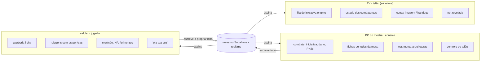
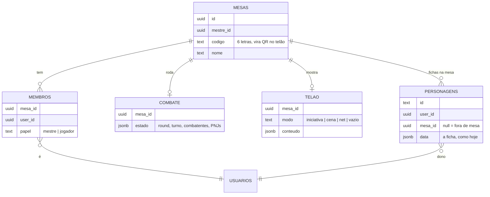
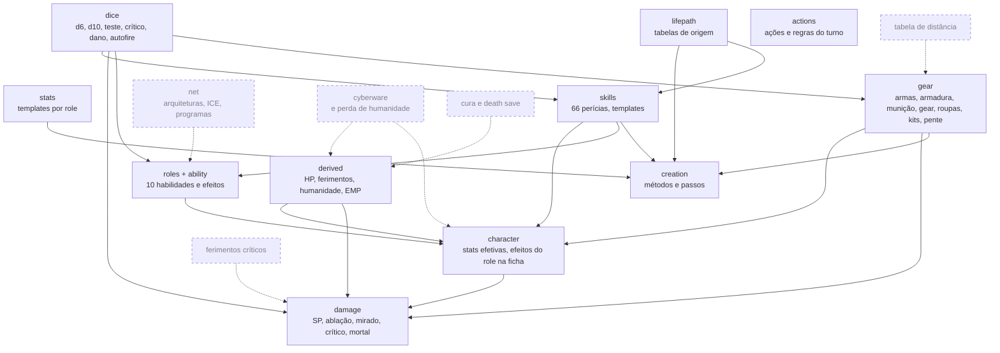

# Mapa

O que o gambiarra.net quer ser, como ele se organiza e o que falta. Pra quem mexe no código (gente ou agente) e pro mestre que joga com ele.

## O que é

Um **VTT pra mesa presencial** de Cyberpunk RED. Não é pra jogar à distância: a turma está na mesma sala, conversando. O app só faz o que papel e livro fazem mal:

- **contas e regras chatas** (bases de perícia, SP, ablação, autofire, ferimentos);
- **estado compartilhado** (iniciativa, HP, munição, quem está ferido);
- **mostrar coisas pra todo mundo** (o turno, a cena, a arquitetura de net).

### O cenário

```
            ┌───────────── sala ─────────────┐
            │                                │
  TV  ◄─────┤  PC do mestre                  │
 (telão)    │  (console do mestre)           │
            │                                │
            │  jogador ── celular (ficha)    │
            │  jogador ── celular (ficha)    │
            │  jogador ── celular (ficha)    │
            └────────────────────────────────┘
       conversa: falada, sempre com o mestre
```

1. O mestre roda o jogo no **PC**, ligado na **TV**.
2. A TV mostra o que é **público**: iniciativa, de quem é o turno, estado dos combatentes, a cena, a net revelada.
3. Cada jogador usa o **celular** como ficha: perícias, armas, munição, rolagens, HP sincronizado.
4. Ninguém digita pra conversar. O jogador fala com o mestre; o app não tem chat.

### Princípios

- **O mestre está no controle.** Só ele mexe no combate, nos PNJs, no telão e no que é revelado.
- **O telão é vitrine.** Não tem botão, não mostra segredo, se lê de longe (fonte grande, contraste alto).
- **O celular é a ficha.** Uma mão só, tela pequena, nada que dependa de hover.
- **A regra mora em `src/lib/rpg`.** Componentes não decidem regra; chamam funções puras. Assim a mesma regra vale no PC, no telão e no celular.
- **Conversa é falada.** Sem chat, sem notificação que tire o olho da mesa.

## As três telas



| informação | mestre (PC) | telão (TV) | jogador (celular) |
|---|---|---|---|
| fila de iniciativa e turno | edita | grande | vê, com destaque na própria vez |
| HP e SP dos PJs | vê e aplica dano | barra e estado | o próprio |
| HP e SP dos PNJs | vê e aplica dano | só o estado (ferido, grave, mortal) | não |
| fichas completas | todas da mesa | não | só a sua |
| rolagens | vê | *decidir* | rola e vê as suas |
| cena, imagem, handout | escolhe | mostra | *decidir* |
| arquitetura de net | completa | só o que foi revelado | o netrunner vê o que descobriu |

### PC e TV: estendido, não espelhado

Com a TV **espelhando** o PC, tudo que o mestre abre aparece pra mesa. O jeito certo é a TV como **segunda tela estendida**: o console fica no monitor/notebook, e uma janela em tela cheia na TV abre a rota do telão (`/mesa/<código>/tela`). Outra opção é a TV abrir essa rota sozinha (smart TV, Chromecast, um PC velho). Se só der pra espelhar, o console precisa de um **modo telão** que esconde segredos.

## Como as telas conversam

Hoje cada conta vê só as próprias fichas, e o combate mora no navegador de quem abriu. Pra jogar como no cenário, o estado precisa morar numa **mesa** compartilhada.



- **Entrar na mesa:** o mestre cria a mesa e o telão mostra o código (e um QR). O jogador abre no celular, entra com o código e escolhe qual ficha leva. Pra amigo não precisar de email, dá pra usar o login anônimo do Supabase só com nome + código.
- **Quem escreve o quê (RLS):** o jogador escreve a própria ficha; o mestre lê todas as fichas da mesa e escreve combate, telão e as mudanças de combate na ficha (HP, SP, munição, penalidade de death save).
- **Ao vivo:** PC, TV e celulares assinam a mesa pelo Supabase Realtime. O mestre aplica dano → o celular do jogador e o telão mudam na hora.
- **Sem conflito de edição:** a ficha tem um dono por vez de campo. O mestre só mexe nos campos de combate; o resto é do jogador.

## Módulos de regras

Tudo em [`src/lib/rpg/`](src/lib/rpg/), funções puras sem React. A UI em [`src/components/`](src/components/) só chama essas funções.



| módulo | arquivo | o que faz | estado | onde aparece |
|---|---|---|---|---|
| dados | `dice.ts` | d6/d10, teste com crítico e falha, dano Nd6 e 2d6×N | feito | tudo |
| stats | `stats.ts` | tabela 10×10 por role (Streetrat e Edgerunner) | feito | criação |
| derivadas | `derived.ts` | HP, limiar grave, estados de ferimento e DV de estabilização, humanidade, EMP em uso | feito | ficha, combate |
| perícias | `skills.ts` | 66 perícias, 9 categorias, stat ligada, básicas, x2, especialização, templates Streetrat | feito | ficha, criação |
| lifepath | `lifepath/` | tabelas de origem, personalidade, família, amigos, inimigos, objetivos | feito | criação, ficha |
| equipamento | `gear/` | armas (brancas, de fogo, exóticas), armaduras, escudo, munição, gear, roupas, preços, kits, pente e recarga | feito; munição especial e granadas sem preço (pág. 344) | ficha, criação, combate |
| roles | `roles/`, `ability.ts` | as 10 habilidades: pontos, listas, usos com rolagem, tabelas, efeitos na ficha, equipe do Exec | feito até rank 4; ranks altos de Rockerboy, Media e Fixer a conferir; Netrunner espera o módulo de net | ficha |
| personagem | `character.ts` | stats efetivas (armadura, EMP, mortal) e efeitos do role em perícias e combate | feito | ficha, combate |
| dano | `damage.ts` | SP do local, ablação, cabeça ×2, mão e perna, crítico +5, mortalmente ferido, desvio do Solo | feito | combate |
| ações | `actions.ts` | ações de combate e regras do turno, resumidas | feito | combate |
| criação | `creation.ts` | métodos e passos (Streetrat completo) | Edgerunner e Complete Package faltam | criação |
| **net** | — | arquiteturas montadas pelo mestre, andares, ICE, programas, cyberdeck | falta (o livro vem depois) | console, telão, celular do netrunner |
| **cyberware** | — | implantes, slots, perda de humanidade | falta | ficha, criação |
| **ferimentos críticos** | — | tabelas de corpo e cabeça, efeitos | falta | combate, ficha |
| **cura e death save** | — | rolagem de death save, cura natural, estabilização | falta (só as DVs) | combate, ficha |
| **distância** | — | DV do tiro único por arma e distância | falta | ficha (arma), combate |
| **resto do livro** | — | moradia e estilo de vida, veículos em combate, Night Market, progressão (IP) | falta | ficha, console |

Fora de `rpg/`, a cola da aplicação:

- [`src/lib/rules.ts`](src/lib/rules.ts): ficha nova, normalização de fichas antigas, vitais de cada combatente.
- [`src/lib/store.ts`](src/lib/store.ts): estado e persistência (local ou Supabase) e as operações de combate. É aqui que entra a mesa compartilhada.
- [`src/lib/types.ts`](src/lib/types.ts): ficha, combatente, inventário, equipe.

## O que já roda hoje

- **Ficha completa** num aparelho só: criação Streetrat, perícias, equipamento, habilidade, lore.
- **Combate num aparelho só**: iniciativa, dano com armadura, PNJs, tela cheia de iniciativa (boa pro telão).
- **Fichas na nuvem** por conta (Supabase), mas cada conta só vê as próprias; combate fica no navegador.
- "Mestre" e "jogador" no login só escolhem quais abas aparecem; ainda não existe mesa.

## Caminho

Cada fase entrega algo jogável.

1. **Mesa compartilhada.** Mesa com código, membros, fichas na mesa, combate na mesa, tudo ao vivo pelo Realtime. *Pronto quando:* o mestre aplica dano no PC e o HP muda no celular do jogador sem recarregar.
2. **Telão.** Rota `/mesa/<código>/tela` em tela cheia: QR pra entrar, fila de iniciativa grande, estado de todo mundo, cena (imagem/handout) escolhida no console. *Pronto quando:* dá pra jogar um combate inteiro olhando só pra TV e falando.
3. **Celular do jogador.** A ficha pensada pra uma mão: aba "combate" com armas, munição, HP e "é a tua vez" em destaque. *Pronto quando:* o jogador não precisa do livro nem de papel durante o combate.
4. **Net.** Construtor de arquitetura no console, net revelada no telão, ações de net do netrunner no celular.
5. **Regras que faltam.** Ferimentos críticos, death save, distância, cyberware, cura; depois o resto do livro.

## Decisões em aberto

- **TV:** estendida (recomendado) ou espelhada com modo telão?
- **Rolagens do jogador:** só no celular dele, também no console do mestre, ou também no telão?
- **Jogadores veem a ficha um do outro?**
- **PNJ no telão:** só o estado (ferido, grave) ou HP em número?
- **Entrar na mesa:** conta com email (como hoje) ou login anônimo só com nome + código?
- **Sem internet:** precisa funcionar se a internet cair? (Com Supabase, não funciona; rede local seria outro projeto.)
